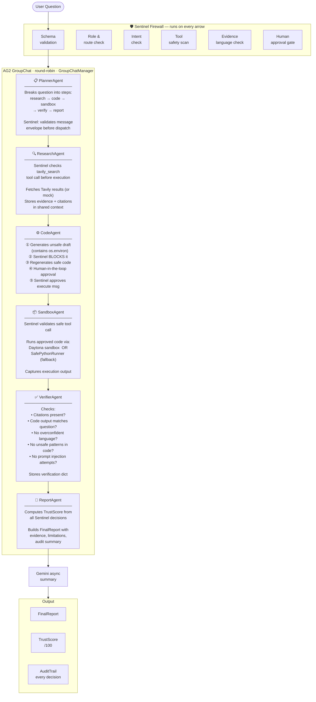

# NLIP Sentinel

**Trust firewall for AG2 multi-agent workflows.**

NLIP Sentinel shows how multi-agent systems can become safer, inspectable, and reproducible. Built on AG2's `GroupChat`, it wires a Sentinel Firewall into every agent's reply function — validating messages, enforcing role-based permissions, blocking unsafe tool calls, requiring human approval for risky actions, and producing a signed audit trail.

## Why This Matters

Most demos show what agents *can* do. NLIP Sentinel shows how I can *trust* them. As agentic frameworks like AG2 make agent-to-agent workflows common, teams need middleware that validates messages, constrains tools, preserves evidence, and explains every decision. That is what Sentinel provides.

## Workflow



## Agents

All six agents inherit from `autogen.ConversableAgent` (via `BaseAgent`) and register a custom `reply_func` with `human_input_mode="NEVER"` and `llm_config=False`. AG2's `GroupChat` coordinates them in round-robin order.

- `PlannerAgent`: decomposes the user request into pipeline steps and validates the first Sentinel message envelope.
- `ResearchAgent`: consumes pre-fetched Tavily results, runs a Sentinel tool check on `tavily_search`, and stores evidence in shared context.
- `CodeAgent`: generates an intentionally unsafe first attempt (blocked by Sentinel), regenerates safe code, and records human-in-the-loop approval.
- `SandboxExecutionAgent`: validates the safe tool call through Sentinel, then executes approved code via Daytona or `SafePythonRunner`.
- `VerifierAgent`: checks claims, citations, execution output, careful language, and unsafe code patterns; stores the verification dict in shared context.
- `ReportAgent`: computes the trust score from all Sentinel decisions and verification results, then produces the `FinalReport`.

## Firewall Checks

- Schema validation for the NLIP-inspired message envelope.
- Role-based sender, receiver, intent, and tool permissions.
- Tool safety checks for shell access, file deletion, environment variables, package install attempts, network calls, `eval`, `exec`, `.env` access, and secret printing attempts.
- Evidence language checks that flag phrases such as “guaranteed,” “proves,” “risk-free,” and “certain profit.”
- Human-in-the-loop approval for high-risk execution.
- Trust scoring across schema validity, permission compliance, tool safety, evidence support, and reproducibility.

## Setup

```bash
cd backend
pip install -r requirements.txt
uvicorn app.main:app --reload
```

```bash
cd frontend
npm install
npm run dev
```

Open the frontend at the Vite URL, usually `http://localhost:5173`.

## Environment Variables

Backend placeholders live in `backend/.env.example`:

```bash
GEMINI_API_KEY=your_gemini_api_key_here
TAVILY_API_KEY=your_tavily_api_key_here
DAYTONA_API_KEY=your_daytona_api_key_here
DAYTONA_API_TOKEN=your_daytona_api_token_here
MODEL_NAME=gemini-1.5-flash
USE_MOCKS=true
```

Frontend public config lives in `frontend/.env.example`:

```bash
VITE_BACKEND_URL=http://localhost:8000
```

`GET /api/demo` works without external API keys. `POST /api/run-workflow` uses deterministic fallback behavior, but when `USE_MOCKS=false` and keys are present it tries real Tavily search, Gemini report synthesis, and Daytona sandbox execution.

## Data Privacy

By default, NLIP Sentinel runs in synthetic demo mode with `USE_MOCKS=true`. In that mode:

- It does not use your private files, browser history, local datasets, credentials, or personal data.
- It does not send the demo question to Gemini, Tavily, Daytona, or any external service.
- The regression uses generated synthetic monthly oil, market, and airline-return samples.
- Research snippets are deterministic mock citations suitable for a reliable live demo.

Only switch `USE_MOCKS=false` if you intentionally want to connect external services. Do not enter private, sensitive, customer, or proprietary data into the prompt unless you have explicitly reviewed the connected adapters and hosting environment.

## Where To Store Keys

Store backend secrets only in `backend/.env` on your local machine:

```bash
cd backend
cp .env.example .env
```

Then replace the placeholder values in `backend/.env`. Keep `USE_MOCKS=true` if you want the no-external-data demo. Set `USE_MOCKS=false` only when you intentionally want external services.

For connected local mode:

```bash
GEMINI_API_KEY=your_real_gemini_key
TAVILY_API_KEY=your_real_tavily_key
DAYTONA_API_KEY=your_real_daytona_key
DAYTONA_API_TOKEN=your_real_daytona_token_if_you_have_one
MODEL_NAME=gemini-1.5-flash
USE_MOCKS=false
```

You can leave `DAYTONA_API_TOKEN` as the placeholder if your Daytona account only provides `DAYTONA_API_KEY`.

Store frontend public config only in `frontend/.env.local`:

```bash
cd frontend
cp .env.example .env.local
```

Only put frontend-safe values there, such as:

```bash
VITE_BACKEND_URL=http://localhost:8000
```

Never put Gemini, Tavily, Daytona, GitHub, or Vercel secret tokens in frontend env files because Vite exposes frontend variables to the browser.

## How To Use The Tool

For the safest live demo:

1. Start the backend.
2. Start the frontend.
3. Open the dashboard.
4. Click `Run Sentinel Demo`.
5. Show the unsafe `os.environ` code attempt getting blocked.
6. Show the regenerated safe code, sandbox output, trust score, final report, and audit trail.

For API-only testing:

```bash
curl http://localhost:8000/api/demo
```

For a custom question without external services, keep `USE_MOCKS=true` and call:

```bash
curl -X POST http://localhost:8000/api/run-workflow \
  -H "Content-Type: application/json" \
  -d '{"question":"Research whether oil price changes meaningfully affect airline stock returns."}'
```

## API

- `GET /`: health check.
- `GET /api/demo`: deterministic demo workflow result.
- `POST /api/run-workflow`: run the workflow for a supplied question.
- `POST /api/firewall/check-message`: validate and check one message envelope.
- `POST /api/firewall/check-tool`: validate and check one tool request.
- `POST /api/human/approve`: demo approval endpoint.

## Secrets and Deployment

- Local backend keys go in `backend/.env`.
- Frontend public config goes in `frontend/.env.local`.
- Frontend variables are visible in the browser, so never place secret API keys there.
- Production backend keys should be stored in the backend hosting provider’s environment variable settings.
- Vercel frontend variables should be stored in Vercel Project Settings -> Environment Variables.
- Only store frontend-safe variables in Vercel frontend, such as `VITE_BACKEND_URL`.
- Never paste real keys in GitHub commits, README files, issues, logs, or screenshots.
- Rotate or revoke keys immediately if accidentally committed.

## Before Pushing To GitHub

```bash
git status
git diff --cached
grep -R "AIza\|tvly\|DAYTONA\|sk-\|GITHUB_TOKEN\|VERCEL" . --exclude-dir=node_modules --exclude-dir=.git --exclude=".env.example"
```

Review any matches carefully. Placeholder variable names are expected, real key-looking values are not.

## Limitations

- The MVP uses synthetic regression data so a live demo is deterministic.
- Tavily and Daytona have graceful mock fallbacks (set `USE_MOCKS=false` to use real APIs).
- The local sandbox is a pragmatic constrained runner, not a hardened container boundary.
- The GroupChat uses round-robin speaker selection; a production version could add LLM-driven dynamic routing.

## Future Work

- Add LLM-backed AG2 agents (AssistantAgent with Gemini/OpenAI) for dynamic reasoning in each role.
- Switch to AG2's `speaker_selection_method="auto"` with an LLM-powered GroupChatManager for adaptive routing.
- Wire official Tavily search and Daytona sandbox execution (already adapter-ready).
- Persist audit trails to a tamper-evident store.
- Add policy authoring UI and per-organization role templates.
- Support richer NLIP-inspired message conformance checks.
